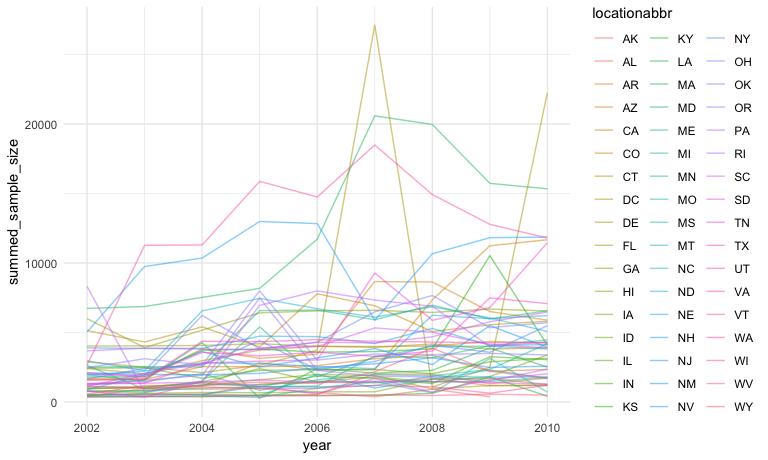
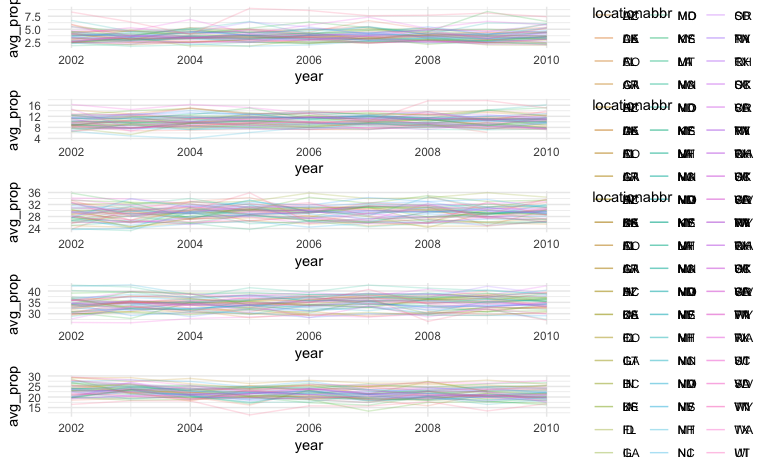
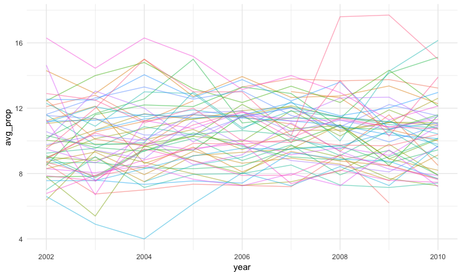
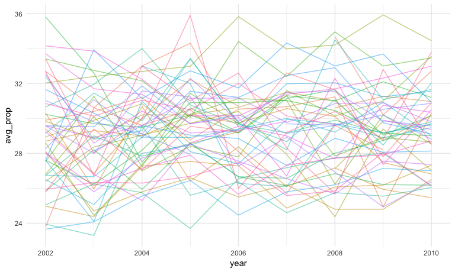
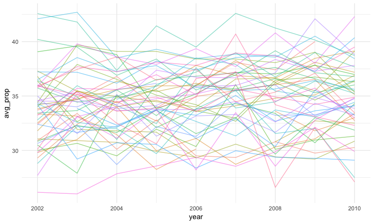
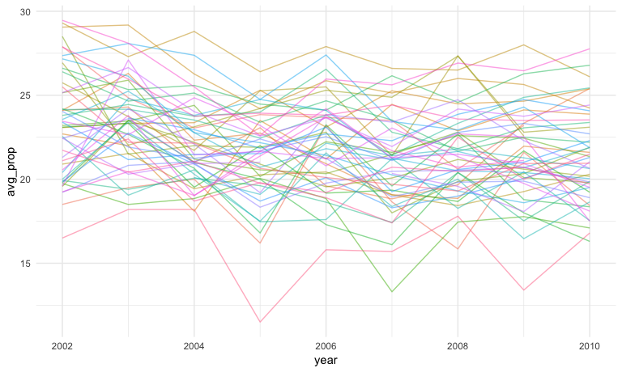

Homework 3 Solutions
================
Christian Pascual
10/4/2018

Preliminary imports and option settings
=======================================

``` r
library(tidyverse)
library(knitr)
library(p8105.datasets)
library(patchwork)

knitr::opts_chunk$set(
  fig.width = 8,
  fig.asp = .6,
  out.width = "90%"
)

theme_set(theme_minimal())
```

This homework focuses on visualization in exploratory data analysis, so we need the plotting from `tidyverse` and the data from `p8105.datasets`. I like the minimal theme, so I've set it for this homework.

Problem 1
=========

Data loading and cleaning
-------------------------

This problem requires the BRFSS dataset, which we'll pull from `p8105.datasets`. We'll clean the dataset a bit before diving into answering the questions

``` r
raw_BRFSS = p8105.datasets::brfss_smart2010

tidy_BRFSS = raw_BRFSS %>% 
  janitor::clean_names() %>% 
  filter(., topic == "Overall Health") %>% 
  mutate(., response = as.factor(response))
```

We've limited our BRFSS dataset to the "Overall Health" topic and converted the `response` column into a factor variable from a string. We can now start asking questions from the data.

Problem 1 questions
-------------------

#### In 2002, which states were observed at 7 locations?

The `locationdesc` column describes where the survey was conducted in a state, and the year encodes when the survey was administered. Thus, we need to use these columns to answer this question. Each state is associated with multiple locations in `locationdesc`, so we can group the states and then count the unique values in this column.

``` r
states_w_7_locs_in_2002 = tidy_BRFSS %>% 
  filter(., year == 2002) %>% 
  group_by(locationabbr) %>% 
  summarize(num_rows = n(),
            num_unique_locs = n_distinct(locationdesc)) %>% 
  filter(., num_unique_locs == 7)

kable(states_w_7_locs_in_2002)
```

| locationabbr |  num\_rows|  num\_unique\_locs|
|:-------------|----------:|------------------:|
| CT           |         35|                  7|
| FL           |         35|                  7|
| NC           |         35|                  7|

There were 3 states with 7 locations listed in 2002. This result suggests that only a few states had such extensive surveying done in the early years of the dataset.

#### Make a “spaghetti plot” that shows the number of observations in each state from 2002 to 2010.

A spaghetti plot seems to be a regular line plot with many, many lines on it. For the BRFSS dataset, our `x` axis will take on the years from 2002 to 2010, and the `y` axis will plot the amount of observations for each state. Each line will correspond to a state, leaving us with 51 lines for each state with one for the District of Columbia.

``` r
spaghetti_states = tidy_BRFSS %>% 
  filter(., year >= 2002 & year <= 2010) %>% 
  group_by(locationabbr, year) %>% 
  summarize(num_rows = n(),
            summed_sample_size = sum(sample_size))

ggplot(data = spaghetti_states, 
       aes(x = year, y = summed_sample_size, color = locationabbr)) +
  geom_line(alpha = 0.5)
```



A lot of stuff is happening in the plot. There is a lot of clumping at the bottom of the graph since many states with relatively small amounts of observations. States like Florida and Texas take extreme values change the axes which make it more difficult to peer into the state-spaghetti clump.

#### Make a table for the years 2002, 2006, and 2010 and show the mean and standard deviation of the proportion of “Excellent” responses across locations in NY State.

To make this table, we need to filter out all the years except for 2002, 2006, and 2010. Then, we can use `group_by()` to gather everything and use `summarize()` to get the mean and standard deviation.

``` r
relevant_years = c(2002, 2006, 2010)

tabulated_stats = tidy_BRFSS %>% 
  filter(., year %in% relevant_years & 
           response == "Excellent" & 
           locationabbr == "NY") %>% 
  group_by(year) %>% 
  summarize(`Mean Excellent prop.` = round(mean(data_value), 1),
            `Std. of Excellent prop.` = round(var(data_value), 1))

kable(tabulated_stats)
```

|  year|  Mean Excellent prop.|  Std. of Excellent prop.|
|-----:|---------------------:|------------------------:|
|  2002|                  24.0|                     20.1|
|  2006|                  22.5|                     16.0|
|  2010|                  22.7|                     12.7|

According to `tabulated_stats`, the mean proportion of "Excellent scores" remains relatively constant from 2002 to 2010, but the variance decreases in this same time frame. This trend suggests that the various locations in NY surveyed have started to agree on the degree of "excellence".

#### For each year and state, compute the average proportion in each response category (taking the average across locations in a state). Make a five-panel plot that shows, for each response category separately, the distribution of these state-level averages over time.

This is a graph that requires 5 separate charts that look at proportion for each `response` value through time. Thus, we'll need to `group_by()` both state and year, and then `summarize()` the `data_value` for each `response` by mean.

``` r
avgd_resp_thru_time = tidy_BRFSS %>% 
  group_by(year, locationabbr, response) %>% 
  summarize(avg_prop = mean(data_value))

# Making individual vars cuz looping syntax looked horrifying
poor_data = filter(avgd_resp_thru_time, response == "Poor")
fair_data = filter(avgd_resp_thru_time, response == "Fair")
good_data = filter(avgd_resp_thru_time, response == "Good")
very_good_data = filter(avgd_resp_thru_time, response == "Very good")
excellent_data = filter(avgd_resp_thru_time, response == "Excellent")

produce_panel = function(data) {
  return(
    ggplot(data = data,
       aes(x = year, y = avg_prop, color = locationabbr)) + 
  geom_line(alpha = 0.5, show.legend=FALSE)
  )
}

produce_panel(poor_data) 
```



``` r
produce_panel(fair_data) 
```



``` r
produce_panel(good_data) 
```



``` r
produce_panel(very_good_data) 
```



``` r
produce_panel(excellent_data)
```



Problem 2
=========

This problem focuses on exploring the Instacart dataset, contained in `p8105.datasets`. To get started, we'll grab the data.

``` r
instacart = p8105.datasets::instacart
```

The `instacart` dataset has 1384617 and 15 columns, making it exceptionally large. In general, the dataset describes the orders and reorders of Instacart users in 2017. We can look at the contents of particular orders by `order_id` and can look at the `department` and `aisle` a product comes from. Along with `product_id`s, we also have access to the precise name of the product in `product_name`, which range from "Bulgarian Yogurt" to "Sustainably Soft Bath Tissue".

The most interesting aspect of the data is perhaps the extensive order information, which we can link not just to users by `user_id` but also if the item is `reordered` or not. The resolution of the data is down to the hour, making it exceptionally granular. We can look at how many orders a user has done (`order_number`) and the precise *order* that a customer added an item to their cart. We may not have all of a user's orders in the dataset, but we do know if an item was `reordered` or not. For example, `user_id 1` ordered 11 items in their 11th order, and 10 of these items were reorders. This data suggests that this user is a frequent user of the site and uses the site to get their regular groceries, based on the items ordered (ie, Whole Milk, Paper Towels and Cinnamon Toast Crunch).

The goal is to do some exploration of this dataset. To that end, write a short description of the dataset, noting the size and structure of the data, describing some key variables, and giving illstrative examples of observations.
