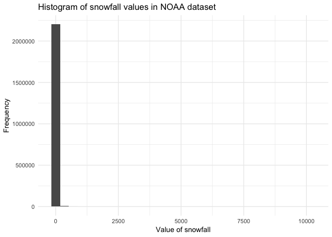
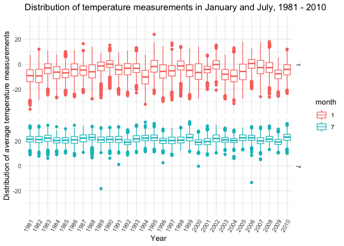
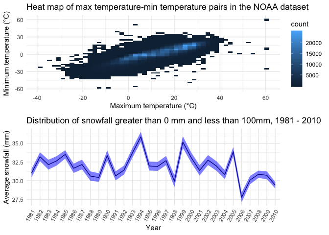
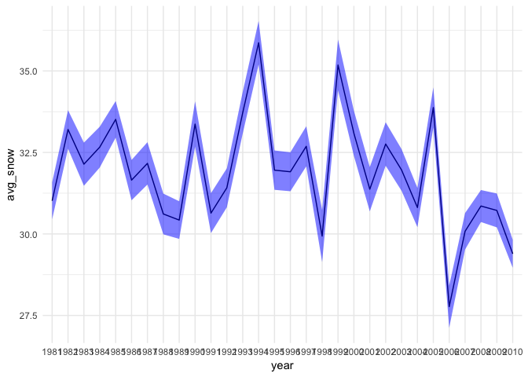
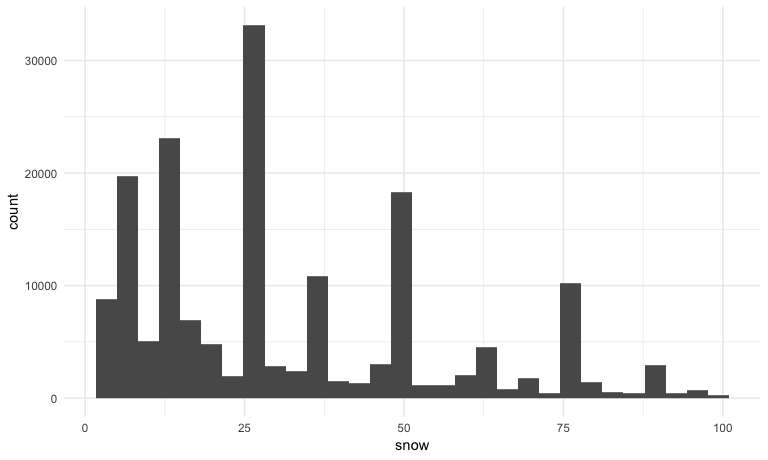

Homework 3 Solutions
================
Christian Pascual
10/4/2018

Preliminary imports and option settings
=======================================

``` r
library(tidyverse)
library(knitr)
library(p8105.datasets)
library(patchwork)

knitr::opts_chunk$set(
  fig.width = 8,
  fig.asp = .6,
  out.width = "90%"
)

theme_set(theme_minimal())
```

This homework focuses on visualization in exploratory data analysis, so we need the plotting from `tidyverse` and the data from `p8105.datasets`. I like the minimal theme, so I've set it for this homework.

Problem 1: BRFSS
================

Data loading and cleaning
-------------------------

This problem requires the BRFSS dataset, which we'll pull from `p8105.datasets`. We'll clean the dataset a bit before diving into answering the questions

``` r
raw_BRFSS = p8105.datasets::brfss_smart2010

tidy_BRFSS = raw_BRFSS %>% 
  janitor::clean_names() %>% 
  filter(., topic == "Overall Health") %>% 
  mutate(., response = as.factor(response))
```

We've limited our BRFSS dataset to the "Overall Health" topic and converted the `response` column into a factor variable from a string. We can now start asking questions from the data.

Problem 1 questions
-------------------

#### In 2002, which states were observed at 7 locations?

The `locationdesc` column describes where the survey was conducted in a state, and the year encodes when the survey was administered. Thus, we need to use these columns to answer this question. Each state is associated with multiple locations in `locationdesc`, so we can group the states and then count the unique values in this column.

``` r
states_w_7_locs_in_2002 = tidy_BRFSS %>% 
  filter(., year == 2002) %>% 
  group_by(locationabbr) %>% 
  summarize(num_rows = n(),
            num_unique_locs = n_distinct(locationdesc)) %>% 
  filter(., num_unique_locs == 7)

kable(states_w_7_locs_in_2002)
```

| locationabbr |  num\_rows|  num\_unique\_locs|
|:-------------|----------:|------------------:|
| CT           |         35|                  7|
| FL           |         35|                  7|
| NC           |         35|                  7|

There were 3 states with 7 locations listed in 2002. This result suggests that only a few states had such extensive surveying done in the early years of the dataset.

#### Make a “spaghetti plot” that shows the number of observations in each state from 2002 to 2010.

A spaghetti plot seems to be a regular line plot with many, many lines on it. For the BRFSS dataset, our `x` axis will take on the years from 2002 to 2010, and the `y` axis will plot the amount of observations for each state. Each line will correspond to a state, leaving us with 51 lines for each state with one for the District of Columbia.

``` r
spaghetti_states = tidy_BRFSS %>% 
  filter(., year >= 2002 & year <= 2010) %>% 
  group_by(locationabbr, year) %>% 
  summarize(num_rows = n(),
            summed_sample_size = sum(sample_size))

ggplot(data = spaghetti_states, 
       aes(x = year, y = summed_sample_size, color = locationabbr)) +
  geom_line(alpha = 0.5)
```


A lot of stuff is happening in the plot. There is a lot of clumping at the bottom of the graph since many states with relatively small amounts of observations. States like Florida and Texas take extreme values change the axes which make it more difficult to peer into the state-spaghetti clump.

#### Make a table for the years 2002, 2006, and 2010 and show the mean and standard deviation of the proportion of “Excellent” responses across locations in NY State.

To make this table, we need to filter out all the years except for 2002, 2006, and 2010. Then, we can use `group_by()` to gather everything and use `summarize()` to get the mean and standard deviation.

``` r
relevant_years = c(2002, 2006, 2010)

tabulated_stats = tidy_BRFSS %>% 
  filter(., year %in% relevant_years & 
           response == "Excellent" & 
           locationabbr == "NY") %>% 
  group_by(year) %>% 
  summarize(`Mean Excellent prop.` = round(mean(data_value), 1),
            `Std. of Excellent prop.` = round(var(data_value), 1))

kable(tabulated_stats)
```

|  year|  Mean Excellent prop.|  Std. of Excellent prop.|
|-----:|---------------------:|------------------------:|
|  2002|                  24.0|                     20.1|
|  2006|                  22.5|                     16.0|
|  2010|                  22.7|                     12.7|

According to `tabulated_stats`, the mean proportion of "Excellent scores" remains relatively constant from 2002 to 2010, but the variance decreases in this same time frame. This trend suggests that the various locations in NY surveyed have started to agree on the degree of "excellence".

#### For each year and state, compute the average proportion in each response category (taking the average across locations in a state). Make a five-panel plot that shows, for each response category separately, the distribution of these state-level averages over time.

This is a graph that requires 5 separate charts that look at proportion for each `response` value through time. Thus, we'll need to `group_by()` both state and year, and then `summarize()` the `data_value` for each `response` by mean.

``` r
avgd_resp_thru_time = tidy_BRFSS %>% 
  group_by(year, locationabbr, response) %>% 
  summarize(avg_prop = mean(data_value))

# Making individual vars cuz looping syntax looked horrifying
poor_data = filter(avgd_resp_thru_time, response == "Poor")
fair_data = filter(avgd_resp_thru_time, response == "Fair")
good_data = filter(avgd_resp_thru_time, response == "Good")
very_good_data = filter(avgd_resp_thru_time, response == "Very good")
excellent_data = filter(avgd_resp_thru_time, response == "Excellent")

produce_panel = function(data) {
  return(
    ggplot(data = data,
       aes(x = year, y = avg_prop, color = locationabbr)) + 
  geom_line(alpha = 0.5, show.legend=FALSE)
  )
}

#produce_panel(poor_data) 
#produce_panel(fair_data) 
#produce_panel(good_data) 
#produce_panel(very_good_data) 
#produce_panel(excellent_data)
```

Problem 2: Instacart
====================

This problem focuses on exploring the Instacart dataset, contained in `p8105.datasets`. To get started, we'll grab the data.

``` r
instacart = p8105.datasets::instacart
```

A cursory look at the Instacart data set
----------------------------------------

The `instacart` dataset has 1384617 and 15 columns, making it exceptionally large. In general, the dataset describes the orders and reorders of Instacart users in 2017. We can look at the contents of particular orders by `order_id` and can look at the `department` and `aisle` a product comes from. Along with `product_id`s, we also have access to the precise name of the product in `product_name`, which range from "Bulgarian Yogurt" to "Sustainably Soft Bath Tissue".

The most interesting aspect of the data is perhaps the extensive order information, which we can link not just to users by `user_id` but also if the item is `reordered` or not. The resolution of the data is down to the hour, making it exceptionally granular. We can look at how many orders a user has done (`order_number`) and the precise *order* that a customer added an item to their cart. We may not have all of a user's orders in the dataset, but we do know if an item was `reordered` or not. For example, `user_id 1` ordered 11 items in their 11th order, and 10 of these items were reorders. This data suggests that this user is a frequent user of the site and uses the site to get their regular groceries, based on the items ordered (ie, Whole Milk, Paper Towels and Cinnamon Toast Crunch). Since this seems to be training data, this dataset was no doubt used to segment Instacart's customers in a machine learning process.

We won't be doing any machine learning in this homework, but we can answer some questions about it.

Problem 2 questions
-------------------

#### How many aisles are there, and which aisles are the most items ordered from?

This question requires us to group the aisles and count the number of rows present for each grouping.

``` r
aisle_grouping = instacart %>% 
  group_by(aisle, aisle_id) %>% 
  summarize(n_rows = n()) %>% 
  arrange(-n_rows)
```

`aisle_grouping` tells us that there are 134 aisles. By counting the number of times an `aisle_id` appears, we can use this to find out where the most items are ordered from. The top 3 aisles that are ordered from are "fresh vegatables", "fresh fruits", and "packaged vegetable fruits". This finding makes sense, since these items spoil relatively fast and thus require frequent ordering. Or perhaps Instacart users are particularly health-inclined.

#### Make a plot that shows the number of items ordered in each aisle.

To approach this problem, we can use the `aisle_grouping` tibble that I created from the last question. `n_rows` represents the number of items ordered, and the tibble has been rearranged into descending order.

``` r
ggplot(data = instacart,
       aes(x = aisle)) +
  geom_bar() + coord_flip()
```


comments about bar graph

#### Make a table showing the most popular item aisles “baking ingredients”, “dog food care”, and “packaged vegetables fruits”

To approach this problem, we require a grouping of the `instacart` data on both the `aisle` and the `product_name`. We can then `summarize()` based on the count of the rows in each of these groups and pick out the exact aisles we need for the table after filtering by rank.

``` r
relevant_aisles = c("baking ingredients", "dog food care", "packaged vegetables fruits")

most_popular_items = instacart %>% 
  group_by(aisle, product_name) %>% 
  summarize(n_rows = n()) %>% 
  filter(min_rank(desc(n_rows)) < 2,
         aisle %in% relevant_aisles) %>% 
  arrange(-n_rows)

kable(most_popular_items)
```

| aisle                      | product\_name                                 |  n\_rows|
|:---------------------------|:----------------------------------------------|--------:|
| packaged vegetables fruits | Organic Baby Spinach                          |     9784|
| baking ingredients         | Light Brown Sugar                             |      499|
| dog food care              | Snack Sticks Chicken & Rice Recipe Dog Treats |       30|

The following table gives the most popular item in the prescribed aisles, along with how many times that item appeared in the dataset.

#### Make a table showing the mean hour of the day at which Pink Lady Apples and Coffee Ice Cream are ordered on each day of the week; format this table for human readers (i.e. produce a 2 x 7 table).

This problem requires a grouping and subsequent spreading of the summary data. We need to group by the relevant items and day of the week, summarizing on the `order_hour_of_day`. After, we spread these rows out into columns for reading ease.

``` r
pink_and_coffee = instacart %>% 
  filter(., product_name == "Pink Lady Apples" | 
           product_name == "Coffee Ice Cream") %>% 
  group_by(product_name, order_dow) %>% 
  summarize(mean_order_hour = mean(order_hour_of_day)) %>% 
  spread(key = order_dow, value = mean_order_hour)

kable(pink_and_coffee)
```

| product\_name    |         0|         1|         2|         3|         4|         5|         6|
|:-----------------|---------:|---------:|---------:|---------:|---------:|---------:|---------:|
| Coffee Ice Cream |  13.77419|  14.31579|  15.38095|  15.31818|  15.21739|  12.26316|  13.83333|
| Pink Lady Apples |  13.44118|  11.36000|  11.70213|  14.25000|  11.55172|  12.78431|  11.93750|

The table tells us that, on average, coffee ice cream is ordered later in the day than Pink Lady Apples. The greatest difference in mean purchase hour is about 4 on Tuesdays, indicating customer realizations that it is only the middle of the week still and they have only 2 days until Data Science homework is due.

Problem 3: NY NOAA
==================

This problem focuses on exploration of the `NY NOAA` dataset. We'll bring in the data first before anything else.

``` r
raw_NY_NOAA = p8105.datasets::ny_noaa
```

A cursory look at the NT NOAA data set
--------------------------------------

In its raw form, the NOAA data set is quite large, coming in at 2595176 rows and 7 columns. The key variables in the dataset describe precipitation (`prcp`), snowfall (`snow`) and temperature (`tmax` and `tmin`) from 01-01-1981 to 12-31-2010. Missing values are *rampant* in the dataset, since we are told that some weather stations collect subsets of the variables. Some rows have missing data for all the weather variables, indicating that neither rain nor snow fell, and temperature was not recorded at that station. With such a large extent of the data missing, we must be midndful of how we filter and look at the data.

Cleaning the NOAA dataset
-------------------------

We'd like to separate the date into its constituent parts and standardize the units between `prcp`, `snow` and `snwd`. The temperature columns need to be converted into doubles (tricky) brought into degrees, rather than tenths of a degree as well.

``` r
clean_NY_NOAA = raw_NY_NOAA %>% 
  separate(., date, into = c("year", "month", "day"), sep = "-") %>% 
  mutate(month = as.integer(month),
         day = as.integer(day),
         prcp_in = ifelse(!is.na(prcp), prcp / 10, NA),
         tmax_C = ifelse(!is.na(tmax), as.double(tmax) / 10, NA),
         tmin_C = ifelse(!is.na(tmin), as.double(tmin) / 10, NA))
```

Problem 3 Questions
-------------------

#### For snowfall, what are the most commonly observed values? Why?

We can get a visualization of the frequency of snowfall measurements in a histogram

``` r
ggplot(data = clean_NY_NOAA,
       aes(snow)) +
  geom_histogram()
```

    ## `stat_bin()` using `bins = 30`. Pick better value with `binwidth`.

    ## Warning: Removed 381221 rows containing non-finite values (stat_bin).



New York's temperautres range greatly throughout the year, and snowfall can only happen when it's below 0°C. It only gets that cold in the winter season, so we can expect that we New York won't get any snowfall when it's warmer. Thus, the most frequently observed snow depth in the dataset is 0.

#### Make a two-panel plot showing the average temperature in January and in July in each station across years. Is there any observable / interpretable structure? Any outliers?

This questions wants to look at January and July through time on the scale of years. We need two plots since question specifies two-panel, so `patchwork` will do that work for us. We can only calculate average temperature when we have both `tmax` and `tmin`, so we have to also filter out rows which do not have both of these values.

``` r
jan_jul_temps = clean_NY_NOAA %>% 
  filter(., month == 1 | month == 7,
         !is.na(tmax_C) & !is.na(tmin_C)) %>% 
  mutate(sample_temp_avg = (tmax_C + tmin_C) / 2)

jan_temps = ggplot(data = filter(jan_jul_temps, month == 1),
                   aes(x = year, y = sample_temp_avg)) +
  geom_boxplot()
jul_temps = ggplot(data = filter(jan_jul_temps, month == 7),
                   aes(x = year, y = sample_temp_avg)) +
  geom_boxplot()

jan_temps / jul_temps
```



Since each station measures a different maximum and minimum temperature, my approach was to look at the distribution of these station measurements with a boxplot. We see that the average temperature in January is much lower than July through the duration of 1981 to 2010, hovering below 0°C. Both January and July have outlier measurements through time, but January seems to have greater variance.

#### Make a two-panel plot showing 1) tmax vs tmin for the full dataset and 2) a plot showing the distribution of snowfall values greater than 0 and less than 100 separately by year.

These two plots require us to look at the entire dataset, so no filters here. We will have one plot for `tmax_C` and `tmin_C` and another for `snow_in` distribution through time.

``` r
min_max_pairs = ggplot(data = clean_NY_NOAA, 
                   aes(x = tmax_C, y = tmin_C)) +
  geom_bin2d(bins = c(50, 50))

snowfall_thru_time = clean_NY_NOAA %>% 
  filter(., snow > 0 & snow < 100) %>% 
  group_by(year) %>% 
  summarize(n_rows = n(),
            avg_snow = mean(snow),
            std_err_snow = (var(snow) / n_rows)**(1/2)) %>% 
  ggplot(data = ., aes(x = year, group = 1)) +
  geom_line(aes(y = avg_snow, fill = "blue")) +
  geom_ribbon(aes(ymin = avg_snow - 1.96 * std_err_snow, 
                  ymax = avg_snow + 1.96 * std_err_snow), 
              fill = "blue", alpha = 0.5)
```

    ## Warning: Ignoring unknown aesthetics: fill

``` r
min_max_pairs
```

    ## Warning: Removed 1136276 rows containing non-finite values (stat_bin2d).



``` r
snowfall_thru_time
```



The `tmax_C` vs `tmin_C` comparison gives us an elliptical shape that suggests that the ranges for the two variables are different. Most of the heat ranges from 0°C to 30°C for `tmax_C` and from 0°C to 15°C for `tmin_C`. These ranges capture the lows of winter to the balmy summers.

The distribution of `snow` shows that snowfall remained relatively stable around 32mm of snow up until 2005. The years after that suggest a drop in the amount of snowfall. The solid line describes the trend in mean snowfall amount, and the ribbon captures a 95% confidence interval for the mean snowfall for each year. The distirbution of snowfall values between 0 and 100 are slightly right-skewed, but the sheer amount of data points can reduce the sampling variance.

``` r
test = clean_NY_NOAA %>% 
  filter(., snow > 0 & snow < 100) %>% 
  ggplot(data = ., aes(x = snow)) +
  geom_histogram()
test
```

    ## `stat_bin()` using `bins = 30`. Pick better value with `binwidth`.


